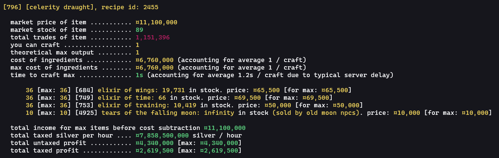

# bdo (market) alchemy profit tool

## contents
- [how to use](#how-to-use)
- [standalone executable (outdated)](#standalone-executable-outdated)
- [todo](#todo)

---

this is a tool that searches the central market for potions and other items that you can make profit on just by buying all the ingredients and selling the result. of course, sometimes there are very few! but they're typically very low volume, limiting total profits. BUT, if there are any, this tool will find them!

it assumes
- you have high enough alchemy mastery (artisan 1) for max procs on recipes that are affected, such as bloods and elixirs.
- you have minimum alchemy time (1s)

here is some example output:

a lot of the outputs from this script that look particularly promising are what I like to refer to as "lies". you can tell this entry is a lie because:
- the silver per hour is too good to be true (and way too good to be an alchemy recipe), although theoretically possible in the ridiculous circumstance that celerity draughts become indispensable and you sell all of the ones you make within the hour
- the total trades are only about 1 million, which marks this item as insanely unpopular

here's an example of a "good" output:

this takes into account market tax and shows the gross potential profit as well as the taxed profit - but it currently assumes you have the value pack and that your fame is level 1 (family fame >= 1000). this is, for all practical purposes &mdash; for better or for worse &mdash; a very safe assumption.

it will also tell you the maximum possible amount of items you can craft (by buying all the available ingredients). if an npc sells the item you need, that will be listed as well.

finally, if you really want to make a quick profit on the market, you basically have to go out and gather super rare ingredients yourself. if you can sap all fifteen thornwood trees on the map or pick all three truffle mushrooms, you'll be rolling in cash! and if you _really_ wanna make the big bucks, head to tunkuta! I'm sure you'll have no trouble at all crafting those 10+ million silver potions if you get some turo blood and hearts...although it seems like 99% of turos must be heartless, bloodless vampires or something. or you could harvest 10000 delotia and get a handful of remnants of burnt spirits for corrupt oil of immortality ;P

good luck!

## how to use

**important note:** if you're in a region other than `naeu`, you'll probably need your own `requestVerificationToken`. currently, you'll have to modify the code because my token is hardcoded in. I'll fix it eventually.

### gem

I made a gem out of this called [bdoap](https://rubygems.org/gems/bdoap). if you have [ruby](https://www.ruby-lang.org/en/) 3.1 installed then you're ready to go. just run `gem install bdoap`. then, run `bdoap` or `gem exec bdoap`.

### source code

if you have [ruby](https://www.ruby-lang.org/en/) 3.1 installed on your computer, you can use the source code.

1.  `git clone git@github.com:jpegzilla/bdo-alchemy-profits.git`
1.  `cd bdo-alchemy-profits`
1.  install [rake](https://ruby.github.io/rake/) (`gem install rake`)
1.  install dependencies (`rake install`)
1.  run the script (`rake start`)
1.  follow the setup instructions and wait! it may take a while, as the script scrapes [bdocodex.com](https://bdocodex.com/us/) for recipe information. it will try to do this as little as possible, because after the first time most recipes will be cached.

## standalone executable (outdated)

standalone executables are available on the [releases page](https://github.com/jpegzilla/bdo-alchemy-profits/releases)!

currently, there's only a build for windows. I don't have a mac or linux machine to test with, so I won't provide binaries for other operating systems yet.

## todo:

-   [x] cache ingredient prices
-   [x] add option to search for all possible alchemy consumables
-   [x] account for market tax
-   [x] warn about low daily volume for ingredients and consumables
-   [ ] add a `--silent` or `--minimal` option to just show bare output
-   [ ] improve incapsula logic
-   [ ] implement real network retry logic
-   [ ] implement http/2
-   [x] **critical:** figure out how to get recipe information without scraping bdocodex. this would speed up the script by a huge amount.
-   [x] make it work
-   [ ] make the code prettier
-   [ ] make it fast
-   [ ] detect optimal matgroup item to use (i.e. purified water is easier to obtain than distilled water, but they're in the same matgroup)
-   [x] add support for non na / eu regions / languages
-   [x] allow user specification of region
-   [ ] allow the script to just start over from the options select when finished, so users can select another category without restarting the whole thing
-   [ ] allow users to specify if they wish to show unprofitable recipes / recipes with out-of-stock ingredients
-   [ ] **critical:** allow users to specify their own request verification token - you need your own for regions other than mine
